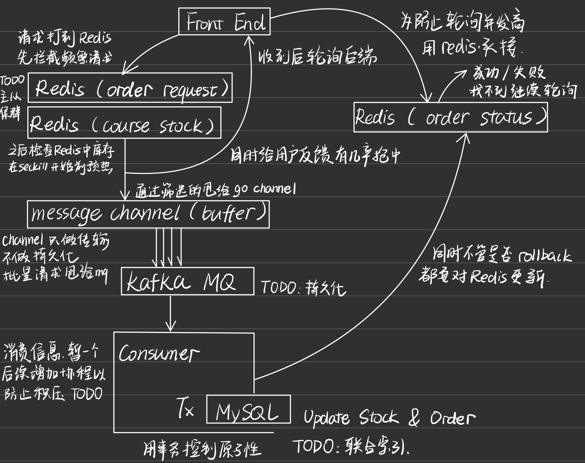

# Course Seckill

## 项目简介
Course Seckill 是一个模拟课程秒杀系统的项目，使用 Go 语言开发，结合了 Kafka、Redis 和 MySQL 等技术栈。该系统旨在处理高并发的秒杀请求，确保数据的一致性和高效的处理能力。

## 项目结构
CourseSeckill/<br>
│── main.go           # 项目的入口文件，初始化数据库、Redis 和 Kafka，并启动服务器<br>
│── internal/         # 包含项目的核心逻辑和功能模块<br>
│   ├── kafka.go      # Kafka 的初始化和消息处理逻辑<br>
│   ├── config.go     # 项目的配置文件，定义了 Kafka、Redis、MySQL 和服务器的配置<br>
│   ├── server.go     # 使用 Gin 框架实现的 HTTP 服务器，提供 API 接口<br>
│   ├── redis.go      # Redis 的初始化和缓存逻辑<br>
│   ├── mysql.go      # MySQL 数据库的初始化和操作逻辑<br>
│── deploy/           # 包含 Docker Compose 文件，用于启动 MySQL、Redis、Zookeeper 和 Kafka 服务<br>
│── web/              # 前端页面，展示课程列表和订单状态<br>
│── test/             # 包含性能测试脚本<br>

## 主要功能
- **课程秒杀**：用户可以通过 API 接口进行课程秒杀操作，系统会处理并发请求并更新库存。
- **订单状态查询**：用户可以查询订单的处理状态。
- **数据库和缓存**：使用 MySQL 存储课程和订单数据，使用 Redis 进行缓存和状态管理。
- **消息队列**：使用 Kafka 处理订单消息，确保系统的高可用性和扩展性。

## 如何运行
1. 确保本地安装了 **Docker** 和 **Docker Compose**。
2. 运行 `make init` 命令初始化项目，启动 Docker 服务。
3. 运行 `make run` 命令启动项目。
4. 访问 `http://localhost:8080` 查看课程列表和订单状态。

## 注意事项
- 在运行项目之前，请确保 **端口 3306、6379、2181 和 9092** 未被占用。
- 项目使用的 **数据库和缓存配置** 可以在 `internal/config.go` 文件中修改。

## 性能测试
- 使用 **Apache Benchmark (ab)** 工具进行性能测试，测试脚本位于 `test/test.sh`。
- 运行 `make bench` 命令执行性能测试。

## 项目依赖
- **Go 1.24.0**
- **Gin 框架**
- **Redis 客户端**
- **Kafka 客户端**
- **GORM ORM**

## 项目架构


## 压测结果

```bash
ab -n 10000 -c 100 -k -r "http://localhost:8080/api/seckill/0/0"
```

```bash
Server Software:        
Server Hostname:        localhost
Server Port:            8080

Document Path:          /api/seckill/0/0
Document Length:        61 bytes

Concurrency Level:      100
Time taken for tests:   0.518 seconds
Complete requests:      10000
Failed requests:        9150 // 正常业务逻辑， total stock 为850 因此有9150次失败
   (Connect: 0, Receive: 0, Length: 9150, Exceptions: 0)
Non-2xx responses:      9150 
Keep-Alive requests:    10000
Total transferred:      2281300 bytes
HTML transferred:       637450 bytes
Requests per second:    19305.28 [#/sec] (mean)
Time per request:       5.180 [ms] (mean)
Time per request:       0.052 [ms] (mean, across all concurrent requests)
Transfer rate:          4300.89 [Kbytes/sec] received

Connection Times (ms)
              min  mean[+/-sd] median   max
Connect:        0    0   0.3      0       3
Processing:     1    5   4.9      4      53
Waiting:        1    5   4.9      4      53
Total:          1    5   5.0      4      53

Percentage of the requests served within a certain time (ms)
  50%      4
  66%      5
  75%      5
  80%      5
  90%      6
  95%      7
  98%     18
  99%     45
 100%     53 (longest request)
```
